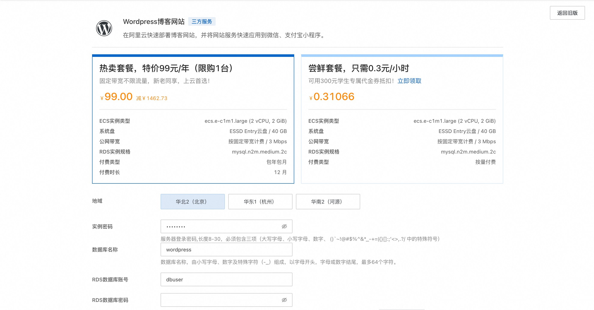
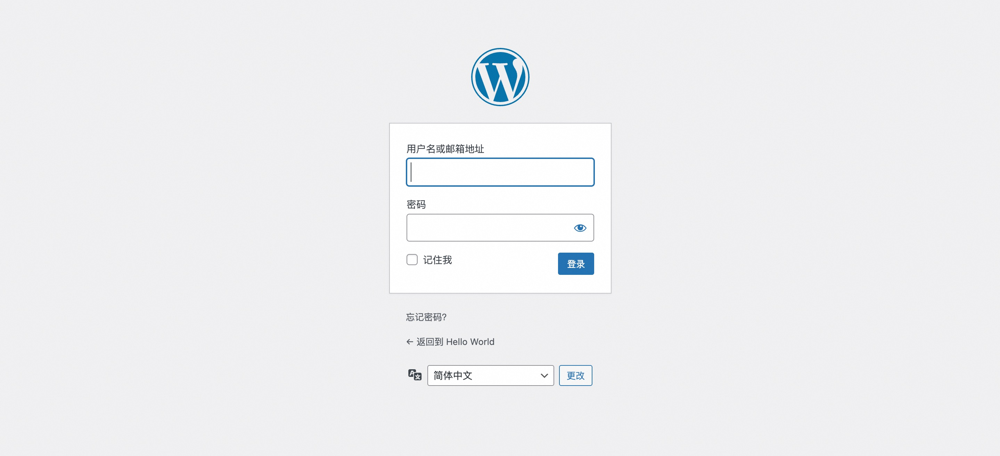

## 简介
本服务搭建了一个基于WordPress的博客网站，开启了REST API以便与客户端进行数据交互，并安装了 JWT 插件用于身份验证和鉴权。

## 计费说明
本服务在阿里云上的费用主要涉及：
* 所选云服务器的规格
* 磁盘容量
* 公网带宽

计费方式：按量付费（小时）或包年包月
预估费用在创建实例时可实时看到。

## RAM账号所需权限

| 权限策略名称                          | 备注                     |
|---------------------------------|------------------------|
| AliyunECSFullAccess             | 管理云服务器服务（ECS）的权限       |
| AliyunVPCFullAccess             | 管理专有网络（VPC）的权限         |
| AliyunROSFullAccess             | 管理资源编排服务（ROS）的权限       |
| AliyunComputeNestUserFullAccess | 管理计算巢服务（ComputeNest）的用户侧权限 |

## 部署服务

1. 单击[部署链接](https://computenest.console.aliyun.com/service/simple/deploy?ServiceId=service-c241ecd19f854cceb4ef)，进入服务实例部署界面，根据界面提示，填写参数。
    

2. 确认订单完成后点击**立即创建**。
3. 等待部署完成后进入服务实例详情。
    

4. 点击公网访问地址使用服务。
    
